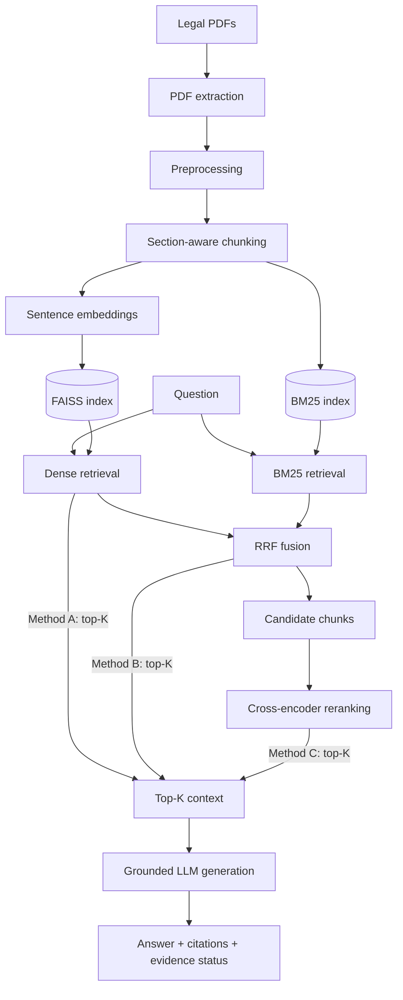

# Methodology

## 1. Experimental design

Three retrieval configurations are compared. **Only the retrieval step differs.**

| | Method A: Dense RAG | Method B: Hybrid RAG | Method C: Hybrid + Reranking |
|---|---|---|---|
| Code name | `dense` | `hybrid` | `hybrid_rerank` |
| Retrieval | FAISS cosine search over sentence embeddings | Dense search **and** BM25, merged with Reciprocal Rank Fusion | Method B candidates re-scored by a cross-encoder |
| Chunks sent to the LLM | top K = 5 | top K = 5 | top K = 5 after reranking |

We do not assume that Method C is better. The results decide.

### What is held constant (fair comparison)

| Item | Value (all in `config.yaml`) |
|---|---|
| Corpus | `ITAct2000.pdf` and `ConsumerProtectionAct2019.pdf`, unaltered |
| Chunking | section-aware, 1000 characters, 150 overlap (one `chunks.json` for every method) |
| Embedding model | `sentence-transformers/all-MiniLM-L6-v2` (used by Methods A, B, C) |
| Candidates | N = 20 from each retriever; M = 20 fused candidates reranked (Method C) |
| RRF constant | k = 60; BM25 parameters k1 = 1.5, b = 0.75 |
| Cross-encoder | `cross-encoder/ms-marco-MiniLM-L-6-v2` (Method C only) |
| Questions | the same 50 questions in `evaluation/questions.json` |
| Generator | one Gemini model for all methods (`llm_model`), temperature 0 |
| Generation prompt | one fixed template in `generate.py`; it never mentions the method |
| Judge | one fixed prompt and one judge model (`judge_model`) for all methods; it is never told the method |
| Evaluation code | `evaluate.py`, `evaluate_answers.py`, `evaluation/metrics.py` |

No model is trained or fine-tuned. Everything is used pretrained.

## 2. Pipelines

```
Legal PDFs  (data/*.pdf)
      |
PDF extraction (PyMuPDF, page by page)
      |
Preprocessing (drop table of contents, ignore footnotes, clean text)
      |
Section-aware chunking  ->  chunks.json  {document, page, section, text}
      |
      +----------------------------+
      |                            |
Sentence embeddings           BM25 index
      |                            |
FAISS index                        |

METHOD A  Dense
  question -> embed -> FAISS top-K ---------------------------------------------+
                                                                                 |
METHOD B  Hybrid                                                                 |
  question -> embed -> FAISS top-N ---+                                          |
  question -> BM25 top-N -------------+--> RRF fusion --> top-K -----------------+
                                                                                 |
METHOD C  Hybrid + Reranking                                                     |
  (as Method B) --> candidate chunks (M) --> Cross-Encoder re-scoring --> top-K -+
                                                                                 |
                                                                                 v
                                        Grounded LLM generation (same prompt for A, B, C)
                                                                                 |
                                                                                 v
                              Answer + citations [document, p. N, Section X]
                              + status: SUPPORTED / INSUFFICIENT EVIDENCE
```

- For **Dense** the BM25, RRF and cross-encoder boxes are bypassed.
- For **Hybrid** the cross-encoder box is bypassed.

Mermaid version, which can be pasted into a diagram tool:



## 3. Components

### Preprocessing and chunking (`ingest.py`)
Text is read page by page. A table of contents on the first pages is discarded. Lines such as `43. Penalty ...` start a new section; gazette footnotes such as `1. Ins. by Act 33 of 2021` are ignored; schedules become `First Schedule` etc. Each section is split into chunks of about 1000 characters with 150 overlap, cutting only at spaces. Every chunk keeps `document`, `page` (the page where the chunk starts), `section` and `text`.

### Dense retrieval
`all-MiniLM-L6-v2` embeds chunks and questions (normalised vectors). A FAISS `IndexFlatIP` returns the nearest chunks, so inner product equals cosine similarity.

### BM25
`rank_bm25.BM25Okapi` over lower-cased word tokens.

### Reciprocal Rank Fusion
`score(chunk) = sum over the two ranked lists of 1 / (k + rank)`, with k = 60. It needs no score scaling.

### Cross-encoder reranking
`ms-marco-MiniLM-L-6-v2` reads each (question, chunk) pair and gives a relevance score. The 20 best fused candidates are re-scored and the top K are kept. It is slower than comparing stored vectors, which is the latency cost measured in the experiment.

### Generation and legal grounding (`generate.py`)
The prompt tells the model to use only the retrieved context, not to invent provisions, sections, cases or penalties, to cite `[document, p. N, Section X]` for every statement, and to reply with the fixed message *"Insufficient evidence in the retrieved legal documents to answer this question reliably."* when the context is not enough. Retrieved text is declared to be data, not instructions. The answer is classified **SUPPORTED** or **INSUFFICIENT EVIDENCE**.

## 4. Evaluation dataset (`evaluation/questions.json`)

50 questions written by the team from the text of the two Acts, **not** generated by a model:

- 44 answerable (22 per Act) and 6 out-of-scope (the documents cannot answer them, for example "Who is the current Prime Minister of India?" or a question about Section 66A, which is not in the 2000 text).
- 10 categories plus out-of-scope: definition, section_specific, legal_obligation, penalty_provision, applicability, scenario_based, comparison, multi_section, exact_terminology, semantic_understanding.
- Difficulty: easy, medium, hard.
- Every answerable question stores its source document and section, the relevant sections (one or several), an expected answer written from the provision, and the page where the section starts (taken automatically from the ingested chunks; the page is `null` for out-of-scope questions).
- The questions are never used to build the index (no leakage). Nothing is trained, so there is no train/test split. Settings (chunk size, K, N, M) were fixed before the final runs.
- `python validate_dataset.py` checks fields, duplicate ids, empty answers, document names, section names, and page numbers against the ingested documents.

Limits of the dataset: written by non-lawyers (team members), a single annotator per question, and 44 answerable questions are enough to see large differences but not small ones.

## 5. Retrieval metrics (`evaluation/metrics.py`)

A retrieved chunk is **relevant** when it comes from the question's source document and its section is in `relevant_sections`. Metrics are computed on the 44 answerable questions.

| Metric | Definition |
|---|---|
| Precision@K | relevant chunks in the top K divided by K |
| Recall@K | distinct relevant sections found in the top K divided by the number of relevant sections (section level, because one section is split into several chunks) |
| Hit@K | 1 if at least one relevant chunk is in the top K, else 0 |
| MRR | 1 divided by the rank of the first relevant chunk (0 if none is found in the top 10) |
| nDCG@5 | rank-weighted gain with binary relevance, divided by the ideal value |
| Latency | wall-clock seconds of the retrieval step per question, after one warm-up query |

K = 3 and 5. These are ranking metrics; Accuracy and F1 are not meaningful here and are not used for retrieval. Because many questions need a section that is split into several chunks, Precision@K has a low ceiling and should be read next to Recall@K and Hit@K.

## 6. Answer-quality evaluation (`evaluate_answers.py`, `evaluation/judge.py`)

For each of the 50 questions and each method the system retrieves K = 5 chunks, generates an answer and stores the answer, the retrieved context, the citations and timings in `evaluation/answers.json`.

**LLM judge.** A separate Gemini model scores each answer from 0 to 3 for correctness (against the expected answer), faithfulness (supported by the retrieved context), relevance and citation correctness. The rubric is in `evaluation/judge.py`. This is **LLM-based evaluation, not human evaluation.** The judge sees the question, expected answer, generated answer, retrieved context and citations, never the method name, and the same judge and prompt are used for all methods.

**Deterministic checks (no LLM):**

- `cite_present`: the answer contains a citation.
- `cite_valid`: the cited document, page and section match a retrieved chunk (an answer must not cite something that was not retrieved).
- `cite_precision`: share of citations pointing to a relevant section; `cite_recall`: share of relevant sections cited (completeness).
- Correct refusal rate on out-of-scope questions and false refusal rate on answerable ones.
- `answer_token_recall`: share of the expected answer's words found in the answer. A rough proxy only; it ignores meaning.

**Manual option.** `python evaluate_answers.py --manual-sheet` writes `evaluation/manual_scoring_sheet.csv` with the same 0-3 rubric so a person can score a sample of answers. No manual scores exist unless someone fills it in.

## 7. Statistical analysis

- Mean, median and standard deviation are reported for each metric, for latency and for the judge scores.
- Charts show the mean with one standard error of the mean.
- Retrieval methods are compared per question with a paired permutation (sign-flip) test. These p-values are **exploratory**: there are 44 questions and many metrics, and no correction for multiple comparisons is applied. They do not establish significance.

## 8. Ablation (`python evaluate.py --ablation`)

| Variant | Components |
|---|---|
| `dense` | dense only |
| `bm25` | BM25 only |
| `dense_bm25` | dense + BM25 merged by interleaving, **without** RRF |
| `hybrid` | dense + BM25 + RRF |
| `hybrid_rerank` | dense + BM25 + RRF + cross-encoder |

This shows what each component adds. Retrieval only; no LLM calls.

## 9. Reproducibility

Everything is configured in `config.yaml` and every step is a command (see `README.md`). Retrieval results are deterministic: the same chunks, models and settings give the same rankings (latency varies by machine). Generated answers use temperature 0, but a hosted model can still change over time, so the model names used are saved with the results.
